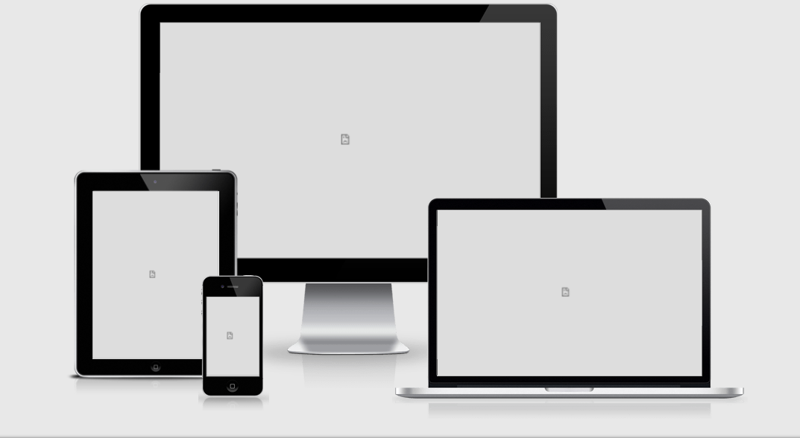

<h1 align="center">Cycle Scene</h1>

- [View the live project here ]()

CycleScene is a website where cycling enthusisats can browse and purchase bicycles and cycling accesories.

The site can be casually browsed without the need for a login or immediate signup.

&nbsp;
&nbsp;

  

----
## 
User Experience
 
----

-   ### User Stories
    &nbsp;  

    -   #### BROWSING AND NAVIGATION
        &nbsp;

        | Number  | Visitor Type   | Visitor Requirements | Desired Outcome     | Complete     |
        | :---:        | :---        |    :---  |          :--- |          :---: |
        | 1 | As a First Time Visitor | I would like to easily understand the purpose of the site| So that I can decide if I am interested in the sites contents  | [x] |
        | 2 | As a First Time, Returning or Frequent Visitor | I would like to view different product categories | So that I easily identify a particular category I am interested in | [ ] |
        | 3 | As a First Time, Returning or Frequent Visitor | I would like to view individual products details | So that I can easily identify, price, product highlights, description, features, extra images and star ratings | [ ] |
        | 4 | As a First Time, Returning or Frequent Visitor | I would like to identify special offers and discounts | So that I can take advantage of offers on products I would like to purchase | [ ] |
        | 5 | As a First Time, Returning or Frequent Visitor | I would like to see the total of my shopping basket easily | So that I can keep track of how much I am going to spend | [ ] |
        &nbsp;
    -   #### REGISTRATION AND USER ACCOUNTS
        &nbsp;

        | Number  | Visitor Type   | Visitor Requirements | Desired Outcome     | Complete     |
        | :---:        | :---        |    :---  |          :--- |          :---: |
        | 1 | As a First Time Visitor | I would like to be able to register for a free account| So that I can make my first purchase from the store | [ ] |
        | 2 | As a Returning or Frequent Visitor | I would like to be able to login and out of my profile | So that I can browse the site without needing to be logged in, and login if I need to make a purchase | [ ] |
        | 3 | As a Returning or Frequent Visitor | I would like to be able to reset my password if I forget it| So that I can quickly restore access to my account | [ ] |
        | 4 | As a First Time Visitor | I would like to receive an email confirmation upon signup| So that I can verify my registration was successful | [ ] |
        | 5 | As a Returning or Frequent Visitor | I would like to be able to access a personal profile page | So that I can view my order history, order status and payment information. | [ ] |
        &nbsp;
    -   #### SORT AND SEARCH
        &nbsp;

        | Number  | Visitor Type   | Visitor Requirements | Desired Outcome     | Complete     |
        | :---:        | :---        |    :---  |          :--- |          :---: |
        | 1 | As a First Time, Returning or Frequent Visitor | I would like to sort a list of products | So that I can Identify the, best rated & best priced products | [ ] |
        | 2 | As a First Time, Returning or Frequent Visitor | I would like to sort a specific category of products | So that I can find the best priced or best rated product, in a specific category | [ ] |
        | 3 | As a First Time, Returning or Frequent Visitor | I would like to search for a product by name or description | So that I can find a particular item I would like to purchase | [ ] |
        | 4 | As a First Time, Returning or Frequent Visitor | I would like to see what ive searched for and the number of results | So that I see if the item Ive searched for is availible on the site | [ ] |
        
        &nbsp;
    -   #### CHECKOUT, PAYMENT AND ORDERS
        &nbsp;

        | Number  | Visitor Type   | Visitor Requirements | Desired Outcome     | Complete     |
        | :---:        | :---        |    :---  |          :--- |          :---: |
        | 1 | As a First Time Visitor, Returning or Frequent Visitor | I would like to see a summary of my order before payment | So that I can be sure of ordering the right amount of the correct item | [] |
        | 2 | As a First Time, Returning or Frequent Visitor | I would like to change the quantity or remove an item  before payment | So that we can change our mind last minute if we need to update the shopping bag| [ ] |
        | 3 | As a First Time, Returning or Frequent Visitor | I would like to view my past orders in my profile | So that I can check back over an old order in case we need to return an item. | [ ] |
        | 4 | As a First Time, Returning or Frequent Visitor | I would like to cancel the checkout process and not proceed to payment | So that I can easily exit out of the payment process should we change our mind | [ ] |
       
        &nbsp;
-   ### Design
    -   #### Colour Scheme
        -   The colour palette used for the site is listed below.
            -  `Orange`
            -  `Off White`
            -  `Black`
            -  `Dark Gray`
            -  `Dusk Grey`
            -  `Light Grey`
            -  `White`
            -  `Darker Grey`
            
            
    -   #### Typography
        - The "Source Sans Pro" font was used as the main body font due to its no nonsense feel and popularity on countless other sites as as always should these font be inaccessable san-serif was chosen to be the backup font.

    -   #### Imagery
        -  The main carousel imagery was chosen to covey a particular message to range of different cycling enthusiasts, from the 'lone wolf' to the serious group rider and lastly to the casual cyclist. The rest of the product images were chosen from 1 or 2 cycling sites, from previous projects I had found mixing images from a lot of different sources produced an inconsistent look and feel to the site.

    - #### Wireframes
        - Sitemap and Desktop Wireframes - [View here](/assets/docs/wireframes/cyclescene-sitemap-desktop.pdf)
        - Sitemap and Tablet Wireframes - [View here](/assets/docs/wireframes/cyclescene-sitemap-tablet.pdf)
        - Sitemap and Mobile Wireframes - [View here](/assets/docs/wireframes/cyclescene-sitemap-mobile.pdf)

    -  #### Diagrams
        - Data Flow Chart - [View Here](/assets/docs/diagrams/cyclescene-dataflowchart.pdf)
        - ERD Table - [View Here](/assets/docs/diagrams/cyclescene-erd.pdf)
        - ERD Flow Chart - [View Here](/assets/docs/diagrams/cyclescene-relationship.pdf)

    -  ### Screenshots
        - Some screenshots of the site - [View here](/assets/docs/)

----
## 
Features
 
----

-   Responsive on all device sizes

-   Interactive elements

-   Create your own login/account.

-   The ability to purchase goods from the store.

-   Showcase working with Django and Sql databases.

----
## 
Technologies Used
 
----

### Languages Used

-   [HTML5](https://en.wikipedia.org/wiki/HTML5)
-   [CSS3](https://en.wikipedia.org/wiki/Cascading_Style_Sheets)
-   [Javascript](https://en.wikipedia.org/wiki/JavaScript)
-   [Python 3](https://en.wikipedia.org/wiki/Python_(programming_language))

### Databases Used

-   

### Services Used

-   [Heroku](https://en.wikipedia.org/wiki/Heroku)
-   [GitHub:](https://en.wikipedia.org/wiki/github)
    

### Frameworks, Libraries & Programs Used

1. [Bootstrap:](https://getbootstrap.com/)
    - Bootstrap instead of Materialize was used on this project to assist with the responsiveness and styling of the website.
2. [JQuery:](https://code.jquery.com/)
    - Some JQuery was used to simplify frontend deployment.  
3. [Google Fonts:](https://fonts.google.com/)
    - Google fonts were used to import the "Source Sans Pro" font into the style.css file which is used on all pages throughout the site, sans-serif was the backup font.
4. [Font Awesome v5.15.4:](https://fontawesome.com/)
    - Font Awesome was used on all pages throughout the website to add icons for aesthetic and UX purposes.
5. [GitPod:](https://www.gitpod.io/)
    - GitPod was used as the main development platform, this was linked to my GitHub repository.
6. [Paint.net:](https://www.getpaint.net/doc/latest/index.html)
    - Paint.net was used for resizing images and editing photos for the website.
7. [Balsamiq:](https://balsamiq.com/)
    - Balsamiq 4.2.1 was used to create the WireFraming during the design process.
8. [Django:](https://www.djangoproject.com/)
    - Django was the chosen framework for the project, I found it very useful that it was so similar to flask in many ways.

----
## 
Testing
 
----

The W3C Mark-up Validator and W3C CSS Jigsaw Validator Services were used to validate every page of the project to ensure there were no syntax errors in the project.
JSHint was used for the javascript linter, and pylint for the python linter.

-   [W3C Html Mark-up Validator](https://jigsaw.w3.org/css-validator/#validate_by_input) - [Results](/assets/docs/testing-and-troubleshooting/html-validation.pdf)
-   [W3C CSS Validator](https://jigsaw.w3.org/css-validator/#validate_by_input) - [Results](/assets/docs/testing-and-troubleshooting/css-results.pdf)
- [JSHint ](https://jshint.com/) - [Results](/assets/docs/testing-and-troubleshooting/jshintresults.pdf)
-   [pylint ](https://pylint.org/) - [Results](/assets/docs/testing-and-troubleshooting/pylint-results.pdf)
-    Code Refactoring  - [Results](/assets/docs/testing-and-troubleshooting/code-refactoring.pdf)

### Testing User Stories from User Experience Section

### Users Stories

-   #### First Time Visitor Goals

    1. As a First Time Visitor, I want to easily understand the main purpose of the site.

        1. Upon landing on the main page users are greeted with a clean responsive site whose imagery and text convey a message that the sites primary goal revolves around Cycling,and purchasing cycling related products, services and accesories.
        

    2. As a First Time Visitor

        1. 
        2. 

    3. As a First Time Visitor

        1. 
    4.  As a First Time Visitor

        1. 

-   #### Returning Visitor Goals

    1. As a Returning Visitor

        1. 

    
    2. As a Returning Visitor

        1. 

    3. As a Returning Visitor

        1. 

-   #### Frequent User Goals  
        
        
    1. As a Frequent Visitor,

        1. 
        
    2. As a Frequent Visitor,

        1. 
    3. As a Frequent Visitor, 

        1. 
      
    4. As a Frequent Visitor, 
        
        1. 

### Further Testing

-   The Website was tested on Google Chrome, Opera, Microsoft Edge and Firefox browsers.
- The website was checked on a variety of emulated devices under Chromes Developer tools, these included Desktop, iPhoneSE, iPhoneXR, iPhone 12 pro, Pixel 5, Samsung Galaxy S8+, Samsung Galaxy S20 ultra, Ipad Air and Mini, Surface Pro 7, Surface Duo, Galaxy Fold, Samsung Galaxy A51/71 and the newer Nest Hub and Nest Hub Max.
-   Internal and external linking were tested throughout the project to ensure functionality.
-   Family members were asked to review the site and to give their initial thoughts and feedback. Their input was used to make small design changes to parts of the site.
- [Site Testing](/assets/docs/testing-and-troubleshooting/site-testing.pdf)

### Known Bugs

-  [Results](/assets/docs/testing-and-troubleshooting/known-bugs.pdf)

----
## 
Deployment
 
----
&nbsp;

The project was deployed using the steps below.

### GitHub

[Steps to setup GitHub](assets/docs/setup-and-deployment/github-setup-and-instructions.pdf)

### GitPod

[Steps to setup GitPod](assets/docs/setup-and-deployment/setting_up_gitpod.pdf)

### Heroku

[Steps to deploy to Heroku](assets/docs/setup-and-deployment/deploying_to_heroku.pdf)

----
## 
The Code
 
----

### Code

- All code was written by myself except for that is explicitly listed in the project files

### Content

-   Privacy Policy - Some of the privacy policy was borrowed from [this link]() to save time on the project. 
-   The remaining content was written by myself with some minor contributions by family and friends.

-   The quote on the main page is by a famous long distance cyclist - Heinz Stucke
&nbsp;

### Media

Images

The images on the Home Page / base template were chosen from the following sources.

1 - Main Cycle Scene Icon was generated here](https://looka.com)
#### Carousel Images
1 - The Image for carousel hero-1 was found here](https://www.pexels.com/photo/rear-view-of-man-on-mountain-road-against-sky-258045/)

2 - The Image for carousel hero-2 was found here](https://www.pexels.com/photo/group-of-men-riding-bicycles-on-road-5970275/)

3 - The Image for carousel hero-3 was found here](https://images.unsplash.com/photo-1604413764976-15c29d2680ae?ixlib=rb-1.2.1&ixid=MnwxMjA3fDB8MHxwaG90by1wYWdlfHx8fGVufDB8fHx8&auto=format&fit=crop&w=872&q=80)
#### Card Images
4 - Card Image for Road Bike](https://images.giant-bicycles.com/b_white,c_pad,h_650,q_80/iplq6m7f5bxssxwglfyl/MY22PropelAdvancedPro0Disc_ColorAPanther.jpg)

5 - Card Image for Mountain Bike](https://images.giant-bicycles.com/b_white,c_pad,h_650,q_80/kp73ggadc1nkvogcwkmx/MY21REIGN_29_SX_ColorAConcrete.jpg)

6 - Card Image for City Bike](https://images.giant-bicycles.com/b_white,c_pad,h_650,q_80/kdjhmafk6kp9ki2l3cd9/MY21Alight3City_ColorATrekkingGreen.jpg)

7 - Card Image for Wheels](https://images.giant-bicycles.com/b_white,c_pad,h_650,q_80/spnwdwmcmavefnboqozj/350000128-350000128-SLR1-DISC-65MM.jpg)

8 - Card Image for Saddles](https://images.giant-bicycles.com/b_white,c_pad,h_650,q_80/upclyhmiiq3tsw0ncvw7/1_CADEX_Boost_Saddle_top_angle.jpg)

9 - Card Image for Bottles and Cages](https://images.giant-bicycles.com/b_white,c_pad,h_650,q_80/fauazh4vrmz88ibvznuj/480000361.jpg)

10 - Card Image for Pumps](https://images.giant-bicycles.com/b_white,c_pad,h_650,q_80/livhngzrauuzx2jrzh0m/2016_Giant_Control_Mini_Combo_Fold_Out_Mini_Track_Pump.jpg)

11 - Card Image for Helmets](https://www.giant-cork.ie/ie/rev-mips-road-helmet)

12 - Card Image for Lights](https://images.giant-bicycles.com/b_white,c_pad,h_650,q_80/saigrabs9broldzopte1/400000167_RECON-HL-200_01.jpg)

#### Products

| | Item1 | Item1 | Item1 | Item2 | Item2 | Item2 | Item3 | Item3 | Item3 | Item4 | Item4  | Item4  | Item5  | Item5 | Item5  | Item6  | Item6  | Item6  |
|---|---|---|---|---|---|---|---|---|---|---|---|---|---|---|---|---|---|---|
| M-Bikes  |  Pic1 | Pic2 | Pic3  | Pic1  | Pic2  | Pic3  | Pic1 | Pic2 | Pic3 | Pic1 | Pic2 | Pic3 | Pic1 | Pic2 | Pic3  | Pic1 | Pic2 | Pic3 |
| R-Bikes  |Pic1 | Pic2 | Pic3  | Pic1  | Pic2  | Pic3  | Pic1 | Pic2 | Pic3 | Pic1 | Pic2 | Pic3 | Pic1 | Pic2 | Pic3  | Pic1 | Pic2 | Pic3 |
| C-Bikes  | Pic1 | Pic2 | Pic3  | Pic1  | Pic2  | Pic3  | Pic1 | Pic2 | Pic3 | Pic1 | Pic2 | Pic3 | Pic1 | Pic2 | Pic3  | Pic1 | Pic2 | Pic3 |
| Chainsets  | Pic1 | Pic2 | Pic3  | Pic1  | Pic2  | Pic3  | Pic1 | Pic2 | Pic3 | Pic1 | Pic2 | Pic3 | Pic1 | Pic2 | Pic3  | Pic1 | Pic2 | Pic3 |
| Cassettes  | Pic1 | Pic2 | Pic3  | Pic1  | Pic2  | Pic3  | Pic1 | Pic2 | Pic3 | Pic1 | Pic2 | Pic3 | Pic1 | Pic2 | Pic3  | Pic1 | Pic2 | Pic3 |
| Saddles  | Pic1 | Pic2 | Pic3  | Pic1  | Pic2  | Pic3  | Pic1 | Pic2 | Pic3 | Pic1 | Pic2 | Pic3 | Pic1 | Pic2 | Pic3  | Pic1 | Pic2 | Pic3 |
| Wheels  | Pic1 | Pic2 | Pic3  | Pic1  | Pic2  | Pic3  | Pic1 | Pic2 | Pic3 | Pic1 | Pic2 | Pic3 | Pic1 | Pic2 | Pic3  | Pic1 | Pic2 | Pic3 |
| Pedals  | Pic1 | Pic2 | Pic3  | Pic1  | Pic2  | Pic3  | Pic1 | Pic2 | Pic3 | Pic1 | Pic2 | Pic3 | Pic1 | Pic2 | Pic3  | Pic1 | Pic2 | Pic3 |
| Brakes  | Pic1 | Pic2 | Pic3  | Pic1  | Pic2  | Pic3  | Pic1 | Pic2 | Pic3 | Pic1 | Pic2 | Pic3 | Pic1 | Pic2 | Pic3  | Pic1 | Pic2 | Pic3 |
| Grips  |  Pic1 | Pic2 | Pic3  | Pic1  | Pic2  | Pic3  | Pic1 | Pic2 | Pic3 | Pic1 | Pic2 | Pic3 | Pic1 | Pic2 | Pic3  | Pic1 | Pic2 | Pic3 |
| Tyres  | Pic1 | Pic2 | Pic3  | Pic1  | Pic2  | Pic3  | Pic1 | Pic2 | Pic3 | Pic1 | Pic2 | Pic3 | Pic1 | Pic2 | Pic3  | Pic1 | Pic2 | Pic3 |
| Frames | Pic1 | Pic2 | Pic3  | Pic1  | Pic2  | Pic3  | Pic1 | Pic2 | Pic3 | Pic1 | Pic2 | Pic3 | Pic1 | Pic2 | Pic3  | Pic1 | Pic2 | Pic3 |
| Bars  |  Pic1 | Pic2 | Pic3  | Pic1  | Pic2  | Pic3  | Pic1 | Pic2 | Pic3 | Pic1 | Pic2 | Pic3 | Pic1 | Pic2 | Pic3  | Pic1 | Pic2 | Pic3 |
| Gels  | Pic1 | Pic2 | Pic3  | Pic1  | Pic2  | Pic3  | Pic1 | Pic2 | Pic3 | Pic1 | Pic2 | Pic3 | Pic1 | Pic2 | Pic3  | Pic1 | Pic2 | Pic3 |
| Tools |  Pic1 | Pic2 | Pic3  | Pic1  | Pic2  | Pic3  | Pic1 | Pic2 | Pic3 | Pic1 | Pic2 | Pic3 | Pic1 | Pic2 | Pic3  | Pic1 | Pic2 | Pic3 |
| Lights | Pic1 | Pic2 | Pic3  | Pic1  | Pic2  | Pic3  | Pic1 | Pic2 | Pic3 | Pic1 | Pic2 | Pic3 | Pic1 | Pic2 | Pic3  | Pic1 | Pic2 | Pic3 |
| Pumps |  Pic1 | Pic2 | Pic3  | Pic1  | Pic2  | Pic3  | Pic1 | Pic2 | Pic3 | Pic1 | Pic2 | Pic3 | Pic1 | Pic2 | Pic3  | Pic1 | Pic2 | Pic3 |
| B-Locks |  Pic1 | Pic2 | Pic3  | Pic1  | Pic2  | Pic3  | Pic1 | Pic2 | Pic3 | Pic1 | Pic2 | Pic3 | Pic1 | Pic2 | Pic3  | Pic1 | Pic2 | Pic3 |
| B&Cages | Pic1 | Pic2 | Pic3  | Pic1  | Pic2  | Pic3  | Pic1 | Pic2 | Pic3 | Pic1 | Pic2 | Pic3 | Pic1 | Pic2 | Pic3  | Pic1 | Pic2 | Pic3 |
| Eyewear | Pic1 | Pic2 | Pic3  | Pic1  | Pic2  | Pic3  | Pic1 | Pic2 | Pic3 | Pic1 | Pic2 | Pic3 | Pic1 | Pic2 | Pic3  | Pic1 | Pic2 | Pic3 |
| Helmets |  Pic1 | Pic2 | Pic3  | Pic1  | Pic2  | Pic3  | Pic1 | Pic2 | Pic3 | Pic1 | Pic2 | Pic3 | Pic1 | Pic2 | Pic3  | Pic1 | Pic2 | Pic3 |
| Gloves |  Pic1 | Pic2 | Pic3  | Pic1  | Pic2  | Pic3  | Pic1 | Pic2 | Pic3 | Pic1 | Pic2 | Pic3 | Pic1 | Pic2 | Pic3  | Pic1 | Pic2 | Pic3 |

13 - Lock 1](https://www.giant-cork.ie/ie/giant-surelock-flex-key-15)

14 - Lock 2](https://www.giant-cork.ie/ie/giant-surelock-protector-1-dt)

15 - Lock 3](https://www.giant-cork.ie/ie/giant-surelock-flex-combo-12)

16 - Bottle 1](https://www.giant-cork.ie/ie/doublespring-waterbottle-750cc-2019)

17 -Bottle 2](https://www.giant-cork.ie/ie/airway-composite-water-bottle-cage)

18 - Bottle 3](https://www.giant-cork.ie/ie/liv-pourfast-double-spring-bottle--750ml--liv)

19 - Brake 1](https://www.giant-cork.ie/ie/giant-caliper-pad---holder)

20 - Brake 2](https://www.giant-cork.ie/ie/giant-tri-comp-linear-pull--v-style--brake-pad---holder)

21 - Brake 3](https://www.giant-cork.ie/ie/conduct-rotor)

22 -City Bike 1](https://www.giant-cork.ie/ie/alight-3-city)

23 - City Bike 2](https://www.giant-cork.ie/ie/flourish-fs-2)

24 - City Bike 3](https://www.giant-cork.ie/ie/escape-1-disc)

25 - Glove 1](https://www.giant-cork.ie/ie/diversion-long-finger-thermal-gloves-2019)

26 - Glove 2](https://www.giant-cork.ie/ie/illume-short-finger-gloves-2019)

27 - Glove 3](https://www.giant-cork.ie/ie/passion-womens-short-finger-gloves)

28 - Helmet 1](https://www.giant-cork.ie/ie/rev-mips-road-helmet)

29 - Helmet 2](https://www.giant-cork.ie/ie/rev-mips-road-helmet)

30 - Helmet 3](https://www.giant-cork.ie/ie/rev--mips--womens-road-helmet-2017)

31 - Helmet 4](https://www.giant-cork.ie/ie/rail-sx-mips-off-road-helmet)

32 - Cassette 1](https://www.wiggle.co.uk/shimano-tourney-tz500-7-speed-cassette)

33 - Cassette 2](https://www.wiggle.co.uk/sram-pg1030-10-speed-mtb-cassette)

34 - Cassette 3](https://www.wiggle.co.uk/shimano-ultegra-6600-10-speed-cassette)

35 - Cassette 4](https://www.wiggle.co.uk/sunrace-12-speed-xd-cassette)

36 - Bar 1](https://www.wiggle.co.uk/science-in-sport-protein-20-bar-12-x-64g)

37 - Bar 2](https://www.wiggle.co.uk/powerbar-energize-advanced-bar-25-x-55g)

38 - Bar2-2](https://www.wiggle.co.uk/powerbar-energize-advanced-bar-25-x-55g)

39 - Gel 1](https://www.wiggle.co.uk/science-in-sport-go-isotonic-energy-gel-mixed-pack-30-x-60ml)

40 - Gel 2](https://www.wiggle.co.uk/science-in-sport-go-isotonic-energy-gels-30-x-60ml)

41 - Chainset 1](https://www.wiggle.co.uk/fsa-k-force-light-386evo-double-chainset-wo-bb)

42 - Chainset 2](https://www.wiggle.co.uk/sram-red-axs-dub-12-speed-crankset)

43 - Chainset 3](https://www.wiggle.co.uk/shimano-xtr-m9020-trail-crank-arms)

44 - Light 1](https://www.giant-cork.ie/ie/recon-tl-200-rear-light-2020)

45 - Light 2](https://www.wiggle.co.uk/lifeline-pavo-2000-lumen-front-light)

46 - Light 3](https://www.wiggle.co.uk/lezyne-femto-usb-drive-bike-light-pair)

47 - Bike 1](https://www.giant-cork.ie/ie/reign-sx-29)

48 - Bike 2](https://www.giant-cork.ie/ie/embolden-2)

49 - Bike 3](https://www.giant-cork.ie/ie/trance-x-advanced-eplus-0-2022)

50 - Bike 4](https://www.giant-cork.ie/ie/reign-advanced-pro-29-1-2022)

51 - Pedal 1](https://www.wiggle.co.uk/nukeproof-horizon-cs-crmo-trail-pedals)

52 - Pedal 2](https://www.wiggle.co.uk/dmr-v6-plastic-flat-pedals)

53 - Pedal 3](https://www.wiggle.co.uk/crankbrothers-mallet-3-pedals)

54 - Pedal 4](https://www.wiggle.co.uk/nukeproof-horizon-pro-sam-hill-enduro-pedals)

55 - Pump 1 ](https://www.giant-cork.ie/ie/giant-control-mini-combo)

56 - Pump 2 ](https://www.giant-cork.ie/ie/control-tower-2-track-pump-2019)

57 - Pump 3 ](https://www.giant-cork.ie/ie/giant-control-mini-mtb)

58 - Road Bike 1](https://www.giant-cork.ie/ie/propel-advanced-pro-disc-0-2022)

59 - Road Bike 2](https://www.giant-cork.ie/ie/enviliv-advanced-pro-disc-1-2022)

60 - Road Bike 3](https://www.giant-cork.ie/ie/propel-advanced-pro-disc-0)

61 - Road Bike 4](https://www.giant-cork.ie/ie/langma-advanced-2-disc)

62 - Saddle 1](https://www.giant-cork.ie/ie/cadex-boost-saddle)

63 - Saddle 2](https://www.wiggle.co.uk/nukeproof-vector-am-comp-cro-mo-saddle)

63 - Saddle 3](https://www.giant-cork.ie/ie/alacra-sl-saddle-2021)

64 - Grip 1](https://www.wiggle.co.uk/ergon-gp5-comfort-grips)

65 - Grip 2](https://www.wiggle.co.uk/brand-x-half-waffle-lock-on-handlebar-grips)

66 - Grip 3](https://www.wiggle.co.uk/lizard-skins-494-single-compound-handlebar-grips)

67 - Sunglasses 1](https://www.wiggle.co.uk/dhb-clark-revo-lens-sunglasses)

68 - Sunglasses 2](https://www.wiggle.co.uk/dhb-pro-triple-lens-sunglasses)

69 - Sunglasses 3](https://www.wiggle.co.uk/tifosi-eyewear-crit-matte-smoke-fototec-sunglasses)

70 - Book 1](https://www.wiggle.co.uk/cordee-complete-bicycle-maintenance-haynes)

71 - Book 2](https://www.wiggle.co.uk/cordee-at-the-edge-danny-macaskill-pb)

72 - Book 3](https://www.wiggle.co.uk/cordee-eat-bike-cook)

73 - Tool 1](https://www.wiggle.co.uk/topeak-mini-p20-multi-tool)

74 - Tool 2](https://www.wiggle.co.uk/fabric-color-coded-11-in-1-multitool)

75 - Tool 3](https://www.wiggle.co.uk/topeak-alien-x-multi-tool)

76 - Wheel 1](https://www.giant-cork.ie/ie/slr-1-disc-full-carbon-aero-65mm-wheelsystem)

77 - Wheel 2](https://www.wiggle.co.uk/nukeproof-horizon-v2-wheel-ard-and-sealant-bundle)

78 - Wheel 3](https://www.giant-cork.ie/ie/sl-1-disc-centre-lock-wheelsystem)

79 - Tyre 1](https://www.wiggle.co.uk/panaracer-fire-xc-pro-tlc-folding-mtb-tyre)

80 - Tyre 2](https://www.wiggle.co.uk/continental-sprinter-gatorskin-tubular-tyre)

81 - Tyre 3](https://www.wiggle.co.uk/continental-contact-city-tyre-1)

The Icons on the various pages were chosen from the following sources.

1 - Search Header Icon](https://fontawesome.com/v5/icons/search?s=solid)

2 - Home Header Icon](https://fontawesome.com/v5/icons/home?s=solid)

3 - Shopping Cart Header Icon](https://fontawesome.com/v5/icons/shopping-bag?s=solid)

4 - Bicycle Header Icon](https://fontawesome.com/v5/icons/bicycle?s=solid)

5 - Carret Left Icon](https://fontawesome.com/v5/icons/caret-left?s=solid)

6 - Carret Right Icon](https://fontawesome.com/v5/icons/caret-right?s=solid)

7 - Map Marker Icon](https://fontawesome.com/v5/icons/map-marker-alt?s=solid)

8 - Facebook Footer Icon](https://fontawesome.com/v5.15/icons/facebook?style=brands)

9 - YouTube Footer Icon](https://fontawesome.com/v5.15/icons/youtube-square?style=brands)

10 - Twitter Footer Icon](https://fontawesome.com/v5.15/icons/twitter?style=brands)

11 - Instagram Footer Icon](https://fontawesome.com/v5.15/icons/instagram?style=brands)

12 - Stripe Footer Icon](https://fontawesome.com/v5/icons/cc-stripe?s=brands)

13 - Visa Footer Icon [View here](https://fontawesome.com/v5/icons/cc-visa?s=brands)

14 - Mastercard Footer Icon [View here](https://fontawesome.com/v5/icons/cc-mastercard?s=brands)

15 - PayPal Footer Icon [View here](https://fontawesome.com/v5/icons/cc-paypal?s=brands)

16 - Created favicon using this site [View here](http://faviconer.com/icon/index) 
 

### Acknowledgements
- My Mentor
- Other cycling enthusiasts!
- Friends and family for input and site testing.