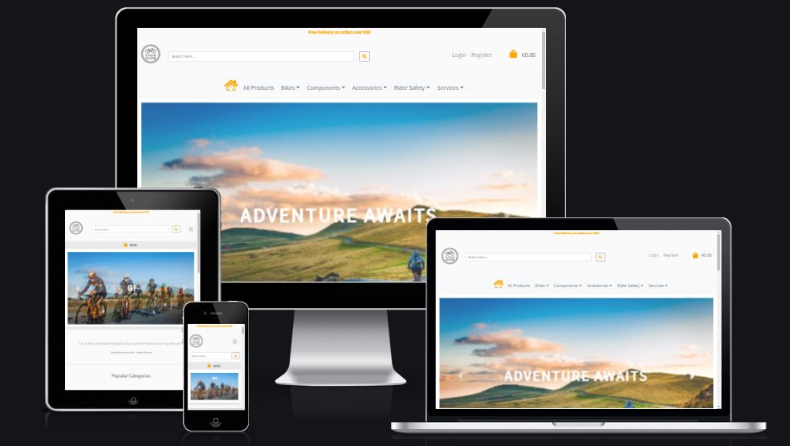

<h1 align="center">Welcome to CycleScene</h1>

&nbsp;
&nbsp;

  

[View the live project here](https://cyclescene.herokuapp.com)

----
&nbsp;

CycleScene is a website where cycling enthusiasts can browse and purchase bicycles and cycling accessories.

The site can be casually browsed without the need for a login or immediate signup.

If the user would like to purchase an item they can register for a new account since a login is required for this action.

&nbsp;

----

## 
What is it and what need does it fulfill?

----

As a big cycling enthusist the topic was an obvious choice for my project, Cyclescene is a culmination of all the technologies, methods and learning outcomes from the full stack course. We use Django here to rapidly put a fully functional site together using the priciples of model view controler design.

The site was built as an ecommerce store as an extension of a physical shop that sells bikes and cycling related accessories. Its need is to provide an online presence and frontend to the physical shop so over time the 2 become synonymous. The owner would like to sell more products of course and expand upon the services they provide.

----
## 
User Experience
 
----

-   ### User Stories
    &nbsp;  

    -   #### BROWSING AND NAVIGATION
        &nbsp;

        | Number  | Visitor Type   | Visitor Requirements | Desired Outcome     |
        | :---:        | :---        |    :---  |          :--- |
        | 1 | As a First Time Visitor | I would like to easily understand the purpose of the site| So that I can decide if I am interested in the sites contents  |
        | 2 | As a First Time, Returning or Frequent Visitor | I would like to view different product categories | So that I easily identify a particular category I am interested in |
        | 3 | As a First Time, Returning or Frequent Visitor | I would like to view individual products details | So that I can easily identify, price, product highlights, description, features, extra images and star ratings |
        | 4 | As a First Time, Returning or Frequent Visitor | I would like to see the total of my shopping basket easily | So that I can keep track of how much I am going to spend |
        &nbsp;
    -   #### REGISTRATION AND USER ACCOUNTS
        &nbsp;

        | Number  | Visitor Type   | Visitor Requirements | Desired Outcome |
        | :---:        | :---        |    :---  |          :--- |
        | 1 | As a First Time Visitor | I would like to be able to register for a free account| So that I can make my first purchase from the store |
        | 2 | As a Returning or Frequent Visitor | I would like to be able to login and out of my profile | So that I can browse the site without needing to be logged in, and login if I need to make a purchase |
        | 3 | As a Returning or Frequent Visitor | I would like to be able to access a personal profile page | So that I can view my order history, order status and payment information. |
        | 4 | As a super user  | I would like to have a tailored profile page | So I or any superuser can quickly create, update and delete products directly from the site.
        
        &nbsp;
    -   #### SORT AND SEARCH
        &nbsp;

        | Number  | Visitor Type   | Visitor Requirements | Desired Outcome |
        | :---:        | :---        |    :---  |          :--- |
        | 1 | As a First Time, Returning or Frequent Visitor | I would like to sort a list of products by rating| So that I can Identify the highest and lowest rated products |
        | 2 | As a First Time, Returning or Frequent Visitor | I would like to sort a specific category of product | So that I can view all products within their respective categories together. |
        | 3 | As a First Time, Returning or Frequent Visitor | I would like to sort a list of products in alphabetical order | So that I can Identify products by their name |
        | 4 | As a First Time, Returning or Frequent Visitor | I would like to sort a list of products by price | So that I can Identify the highest and lowest priced products |
        | 5 | As a First Time, Returning or Frequent Visitor | I would like to search for a product by name or description | So that I can find a particular item I would like to purchase |
        | 6 | As a First Time, Returning or Frequent Visitor | I would like to see what i've searched for and the number of results | So that I can see if the item i've searched for is availible on the site |
        
        &nbsp;
    -   #### CHECKOUT, PAYMENT AND ORDERS
        &nbsp;

        | Number  | Visitor Type   | Visitor Requirements | Desired Outcome     |
        | :---:        | :---        |    :---  |          :--- |
        | 1 | As a First Time Visitor, Returning or Frequent Visitor | I would like to see a summary of my order before payment | So that I can be sure of ordering the right amount of the correct item |
        | 2 | As a First Time, Returning or Frequent Visitor | I would like to change the quantity or remove an item  before payment | So that we can change our mind last minute if we need to update the shopping bag|
        | 3 | As a First Time, Returning or Frequent Visitor | I would like to view my past orders in my profile | So that I can check back over an old order in case we need to return an item. |
        | 4 | As a First Time, Returning or Frequent Visitor | I would like to see if the product is 'In stock' or has a discount applied to it. | So that we can change our mind before the purchase in case we have to wait for the product to become available and want to cancel the order, or in case a promotional discount we though the product had, is no longer valid |
        | 5| As a First Time, Returning or Frequent Visitor | I would like to cancel the checkout process and not proceed to payment | So that I can easily exit out of the payment process should we change our mind |
       
        &nbsp;
-   ### Design
    -   #### Colour Scheme 
        -   The colour palette used for the site is listed below.
            -  `Orange`
            -  `Off White`
            -  `Black`
            -  `Dark Gray`
            -  `Dusk Grey`
            -  `Light Grey`
            -  `White`
            -  `Darker Grey`
            -  `Green`
            -  `Red`
            -  `Yellow`
            -  `Lighter Green`

            
            
    -   #### Typography
        - The "Source Sans Pro" font was used as the main body font due to its no nonsense feel and popularity on countless other sites as as always should these font be inaccessable san-serif was chosen to be the backup font.

    -   #### Imagery
        -  The main carousel imagery was chosen to covey a particular message to range of different cycling enthusiasts, from the 'lone wolf' to the serious group rider and lastly to the casual cyclist. The rest of the product images were chosen from 1 or 2 cycling sites, from previous projects I had found mixing images from a lot of different sources produced an inconsistent look and feel to the site.

    - #### Wireframes
        - Sitemap Desktop, Tablet & Mobile Wireframes - [View here](/assets/docs/wireframes/cyclescene-sitemap-desktop-tablet-mobile.pdf)

    -  #### Diagrams
        - Data Flow Chart - [View Here](/assets/docs/diagrams/CycleScene-dataflowchart.pdf)
        - ERD Table - [View Here](/assets/docs/diagrams/CycleSceneERD.pdf)

    -  ### Screenshots
        - Screenshots of the site see below

| Home  |Profile | Products  | Authorization | Checkout | Shoppingbag | Categories  | Other |
| :--- | :--- | :--- | :--- | :--- |:--- | :--- | :--- |
| [Logged out](/assets/docs/screenshots/homenologin.png)  | [Standard User](/assets/docs/screenshots/profilestduser.png)  |[All Products](/assets/docs/screenshots/allprod.png)   | [Logout](/assets/docs/screenshots/logout.png)  | [Checkout](/assets/docs/screenshots/checkout.png)  | [Shopping Bag](/assets/docs/screenshots/shoppingbag.png)  | [Road Bike](/assets/docs/screenshots/catroad.png)  | [Legal](/assets/docs/screenshots/legal.png)  |
|  [Standard User](/assets/docs/screenshots/homestduser.png) |  [Product Manager](/assets/docs/screenshots/productmanager.png) |  [Standard User Details](/assets/docs/screenshots/productdetailsstduser.png) | [Password Reset](/assets/docs/screenshots/passreset.png)  | [Checkout Success](/assets/docs/screenshots/checkoutsuccess.png)  | -  | [City Bike](/assets/docs/screenshots/catcity.png)  | [Services](/assets/docs/screenshots/services.png)  |
|  [Super User](/assets/docs/screenshots/homesuper.png) | [Super User Add](/assets/docs/screenshots/productmanageradd.png)  | [Super User Details](/assets/docs/screenshots/productdetailssuper.png)  |[Register](/assets/docs/screenshots/register.png)   |  - | - | [Mountain Bike](/assets/docs/screenshots/catmtb.png)  |  - |
|  -| [Super User Edit](/assets/docs/screenshots/productmanageredit.png)  | -  |[Sign In](/assets/docs/screenshots/signin.png)   |  - | - | [Eyewear](/assets/docs/screenshots/cateyewear.png)  |  - |
|  - | -  | -  |-   |  - | - | [Helmets](/assets/docs/screenshots/cathelmet.png)  |  - |
|  - | -  | -  |-   |  - | -  | [Lights](/assets/docs/screenshots/catlights.png)  |  - |
|  - | - | - |-   |  - | -  | [Pumps](/assets/docs/screenshots/catpump.png)  |  - |
|  - | -  | -  |-   |  - | -  | [Saddles](/assets/docs/screenshots/catsaddles.png)  |  - |
|  - | -  | -  |-   |  - | -  | [Wheels](/assets/docs/screenshots/catwheels.png)  |  - |
|  -| -  | - |-   |  - | -  | [Locks](/assets/docs/screenshots/catlocks.png)  |  - |

----
## 
Features
 
----

-   Responsive on all device sizes

-   Interactive elements

-   Create your own login/account.

-   The ability to purchase goods from the store.

-   Showcase working with Django and Sql databases.

----
## 
Technologies Used
 
----

### Languages Used

-   [HTML5](https://en.wikipedia.org/wiki/HTML5)
-   [CSS3](https://en.wikipedia.org/wiki/Cascading_Style_Sheets)
-   [Javascript](https://en.wikipedia.org/wiki/JavaScript)
-   [Python 3](https://en.wikipedia.org/wiki/Python_(programming_language))

### Databases Used

-   

### Services Used

-   [Heroku:](https://en.wikipedia.org/wiki/Heroku)
-   [GitHub:](https://en.wikipedia.org/wiki/github)
-   [GitPod:](https://gitpod.io)
-   [AWS](https://aws.amazon.com)
-   [Stripe](https://stripe.com/en-ie)
    

### Frameworks, Libraries & Programs Used

1. [Bootstrap:](https://getbootstrap.com/)
    - Bootstrap instead of Materialize was used on this project to assist with the responsiveness and styling of the website.
2. [JQuery:](https://code.jquery.com/)
    - Some JQuery was used to simplify frontend deployment.  
3. [Google Fonts:](https://fonts.google.com/)
    - Google fonts were used to import the "Source Sans Pro" font into the style.css file which is used on all pages throughout the site, sans-serif was the backup font.
4. [Font Awesome v5.15.4:](https://fontawesome.com/)
    - Font Awesome was used on all pages throughout the website to add icons for aesthetic and UX purposes.
5. [GitPod:](https://www.gitpod.io/)
    - GitPod was used as the main development platform, this was linked to my GitHub repository.
6. [Paint.net:](https://www.getpaint.net/doc/latest/index.html)
    - Paint.net was used for resizing images and editing photos for the website.
7. [Balsamiq:](https://balsamiq.com/)
    - Balsamiq 4.2.1 was used to create the WireFraming during the design process.
8. [Django:](https://www.djangoproject.com/)
    - Django was the chosen framework for the project, I found it very useful that it was so similar to flask in many ways.
9. [Crispy Forms for Bootstrap 5:](https://github.com/django-crispy-forms/crispy-bootstrap5) - Crispy form for Boostrap 5 were used. 

----
## 
Testing
 
----

### Payment Testing

The payment system is provided by Stripe

Test card used:

- Card number: 4242424242424242 (16-digit Card number)
- CVC: Any 3 digit combination (424 Works).
- Dates: Any future date (04/24 used).
- [Stripe Card Docs](https://stripe.com/docs/testing#cards)

&nbsp;

### Validation and Testing

&nbsp;

The W3C Mark-up Validator and W3C CSS Jigsaw Validator Services were used to validate every page of the project to ensure there were no syntax errors in the project.
JSHint was used for the javascript linter, and pylint for the python linter.

-   [W3C Html Mark-up Validator](https://jigsaw.w3.org/css-validator/#validate_by_input) - See table below for results.

| Home  |Profile | Products  | Authorization | Checkout | Shoppingbag | Categories  | Other |
| :--- | :--- | :--- | :--- | :--- |:--- | :--- | :--- |
|[Home No login](/assets/docs/testing-and-troubleshooting/html/home.png)|[Profile Std User](/assets/docs/testing-and-troubleshooting/html/profile-stduser.png) |[Product Details Std User](/assets/docs/testing-and-troubleshooting/html/productdetails-stduser.png) |[Password Reset](/assets/docs/testing-and-troubleshooting/html/passwordreset.png) |[Checkout](/assets/docs/testing-and-troubleshooting/html/checkout.png) |[Shopping Bag](/assets/docs/testing-and-troubleshooting/html/shoppingbag.png) |[City Bikes](/assets/docs/testing-and-troubleshooting/html/citybikes.png) |[Services](/assets/docs/testing-and-troubleshooting/html/services.png) |
|[Home Std User](/assets/docs/testing-and-troubleshooting/html/home-stduser.png) |[Profile Super User](/assets/docs/testing-and-troubleshooting/html/profile-superuser.png) |[Product Details Super User](/assets/docs/testing-and-troubleshooting/html/productdetails-superuser.png) |[Register](/assets/docs/testing-and-troubleshooting/html/register.png) |[Checkout Success](/assets/docs/testing-and-troubleshooting/html/checkoutsuccess.png) |-|[Eye Wear](/assets/docs/testing-and-troubleshooting/html/eyewear.png) |[Legal](/assets/docs/testing-and-troubleshooting/html/legal.png) |
|[Home Super User](/assets/docs/testing-and-troubleshooting/html/home-superuser.png) |[Product Manager Add](/assets/docs/testing-and-troubleshooting/html/productmanager-add.png) |[All Products](/assets/docs/testing-and-troubleshooting/html/allproducts.png) |[Registration Verification](/assets/docs/testing-and-troubleshooting/html/registration-verification.png) |- |- |[Helmets](/assets/docs/testing-and-troubleshooting/html/helmets.png) |- |
|- |[Product Manager Update](/assets/docs/testing-and-troubleshooting/html/productmanager-update.png) | - |[Sign In](/assets/docs/testing-and-troubleshooting/html/signin.png) | - |- |[Lights](assets/docs/testing-and-troubleshooting/html/lights.png) |-|
|- |- |- |[Sign Out](/assets/docs/testing-and-troubleshooting/html/signout.png)|- |- |[Locks](/assets/docs/testing-and-troubleshooting/html/locks.png) |-|
|- |- |- |-|- |- |[Mountain Bike](/assets/docs/testing-and-troubleshooting/html/mtbbikes.png) |-|
|- |- |- |-|- |- |[Pumps](/assets/docs/testing-and-troubleshooting/html/pumps.png) |-|
|- |- |- |-|- |- |[Road Bikes](/assets/docs/testing-and-troubleshooting/html/roadbikes.png) |-|
|- |- |- |-|- |- |[Saddles](/assets/docs/testing-and-troubleshooting/html/saddles.png) |-|
|- |- |- |-|- |- |[Wheels](/assets/docs/testing-and-troubleshooting/html/wheels.png) |-|

-   [W3C CSS Validator](https://jigsaw.w3.org/css-validator/#validate_by_input) - [Results](/assets/docs/testing-and-troubleshooting/css/css-results.png)
- [JSHint ](https://jshint.com/) - [Results](/assets/docs/testing-and-troubleshooting/javascript/jshintresults.pdf)
-   [pylint ](https://pylint.org/) - [Results](/assets/docs/testing-and-troubleshooting/python/pylintscores.pdf)
- [Code Refactoring ](/assets/docs/testing-and-troubleshooting/coderefactoring.pdf)
- [Performance Testing Lighthouse](/assets/docs/testing-and-troubleshooting/lighthouse/lighthouse.pdf)
- [Functionality Useabilty & Datamanagement Testing](/assets/docs/testing-and-troubleshooting/functionality-useabilty-datamanagement-testing.pdf)
&nbsp;

----
## 
User Experience
 
----

-   ### Testing User Stories from User Experience Section
    &nbsp;  

    -   #### BROWSING AND NAVIGATION
        &nbsp;

        | Number  | Visitor Type   | Visitor Requirements | Desired Outcome | Tested Outcome | Complete  |
        | :---:        | :---        |    :---  |          :--- | :--- | :---: |
        | 1 | As a First Time Visitor | I would like to easily understand the purpose of the site| So that I can decide if I am interested in the sites contents  | Upon landing on the main page users are greeted with a clean responsive site whose imagery and text convey a message that the sites primary goal revolves around cycling, and purchasing cycling related products, services and accessories | &#9745; |
        | 2 | As a First Time, Returning or Frequent Visitor | I would like to view different product categories | So that I easily identify a particular category I am interested in |  This user story is catered for in both the header and footer, the simple categorised main navigation menu along with  the footer section 'Browse by category' are always obvious and present on every page reassuring the user that they will always be able to jump between different categories | &#9745; |
        | 3 | As a First Time, Returning or Frequent Visitor | I would like to view individual products details | So that I can easily identify, price, product highlights, description, features, extra images and star ratings |   This user story has been tested so that when the user clicks/taps on a product be it in mobile or desktop, all product details are displayed in a user friendly format. These include the 'star rating' first followed by, extra images, highlights, description, features and price. | &#9745;|
        | 4 | As a First Time, Returning or Frequent Visitor | I would like to see the total of my shopping basket easily | So that I can keep track of how much I am going to spend |  This user story is fulfilled on desktop which has the shopping bag and the subtotal in the top right hand corner of the screen. The user is able to browse the site adding and removing products to their bag, a quick glance lets them know what the cost is going to be. The user story is equally fulfilled on mobile and tablet views but this time the shopping bag and the subtotal is in the center of the screen. Futher more the session variable was tested by leaving items in the users shopping bag and navigating away from the site entirely. Once we browsed the site again the contents of our shopping bag stayed intact.| &#9745; |
        &nbsp;
    -   #### REGISTRATION AND USER ACCOUNTS 
        &nbsp;

        | Number  | Visitor Type   | Visitor Requirements | Desired Outcome | Tested Outcome | Complete  |
        | :---:        | :---        |    :---  |          :--- | :--- | :---: |
        | 1 | As a First Time Visitor | I would like to be able to register for a free account| So that I can make my first purchase from the store | This user story was tested by having the register link present at the top right of the site on dekstop and as the second option on mobile menu. The checkout functions have been secured with the @login_required parameter so they cannot be bypassed by an unregistered user. When an unregisterd user clicks on the shopping bag he is automatically redirected to the 'sign in' page, and from here they can easily access the register link. | &#9745; |
        | 2 | As a Returning or Frequent Visitor | I would like to be able to login and out of my profile | So that I can browse the site without needing to be logged in, and login if I need to make a purchase | This user story was tested first as a logged out user, the user can go as far as added removing and viewing their shopping bag but once the hit the 'Secure Checkout' button they are prompted to login. Similarly after logging into their account, they can view their profile page and make a purchase. | &#9745; |
        | 3 | As a Returning or Frequent Visitor | I would like to be able to access a personal profile page | So that I can view my order history, order status and payment information. | This user story was tested by first registering for an account verifying the email address and then logging in using the sign up form. Once logged in the user can click on the 'My Profile' link, from here there are 2 sections, a form to update their personal details and order history of past orders with clickable links.| &#9745; |
        | 4 | As a super user  | I would like to have a tailored profile page | So I or any superuser can quickly create, update and delete products directly from the site. | This user story has been tested by logging in as a super user, from here they will see a link called 'Product Manager' rather than 'My Profile', also the banner of the site changes to remind the user of this. The normal order history and personal information has been replaced with a listing of all the products with 'Update' and 'Delete' buttons. In addition a very obvious create button is at the top of the page so the user doesnt have to scroll down every time. Also when logged in a as super user, the products on the site can be browsed and each one has an additional 'Update' and 'Delete' button along with a link back to 'Product Manager'. | &#9745; |
        &nbsp;
    -   #### SORT AND SEARCH
        &nbsp;

        | Number  | Visitor Type   | Visitor Requirements | Desired Outcome     | Tested Outcome | Complete  |
        | :---:        | :---        |    :---  |          :--- |          :--- | :---: |
        | 1 | As a First Time, Returning or Frequent Visitor | I would like to sort a list of products by rating | So that I can Identify the highest and lowest rated products | This user story was tested by performing the following actions, choosing the 'All Products' link to list all the sites products, we have a filter box named 'Rating' with up and down arrows, clicking either of the arrows will filter the products by either the lowest or highest rating. | &#9745; |
        | 2 | As a First Time, Returning or Frequent Visitor | I would like to sort a specific category of product | So that I can view all products within their respective categories together | This user story was tested by performing the following actions, choosing the 'All Products' link to list all the sites products, we have a filter box named 'Category' with up and down arrows, clicking either of the arrows will group the products by their associated categories.  | &#9745; |
        | 3 | As a First Time, Returning or Frequent Visitor | I would like to sort a list of products in alphabetical order | So that I can Identify products by their name | This user story was tested by performing the following actions, choosing the 'All Products' link to list all the sites products, we have a filter box called 'Name' with up and down arrows, clicking either of the arrows will group the products alphabetically.  | &#9745; |
        | 4 | As a First Time, Returning or Frequent Visitor | I would like to sort a list of products by price | So that I can Identify the highest and lowest priced products | This user story was tested by performing the following actions, choosing the 'All Products' link to list all the sites products, we have a filter box called 'Price' with up and down arrows, clicking either of the arrows will group the products by either the highest or lowest price. | &#9745; |
        | 5 | As a First Time, Returning or Frequent Visitor | I would like to search for a product by name, description, or product highlight | So that I can find a particular item I would like to purchase | This user story was verified by selecting certain search terms that were common or unique to a particular product. Due to it being a 'OR' search request, should the search term not be found the results will display a message to the user and bring them back to safety with a call to action button. If the search term query is blank, it best to display 'all products' with an associated message to the user rather than a blank result | &#9745; |
        | 6 | As a First Time, Returning or Frequent Visitor | I would like to see what ive searched for and the number of results | So that I can see if the item i've searched for is availible on the site | This user story was tested by searching for deliberate known key words that both existed and also did not exist. In each case the search result will return a list of items with the 'Product Found' count listed at the top of the screen where it is very visible to the user, if the search result is not found there is an obvious message 'Sorry no results found' link to bring the user back to safety.  | &#9745; |
        
        &nbsp;
    -   #### CHECKOUT, PAYMENT AND ORDERS
        &nbsp;

        | Number  | Visitor Type   | Visitor Requirements | Desired Outcome     | Tested Outcome | Complete     |
        | :---:        | :---        |    :---  |          :--- |          :--- | :---: |
        | 1 | As a First Time Visitor, Returning or Frequent Visitor | I would like to see a summary of my order before payment | So that I can be sure of ordering the right amount of the correct item | This user story was tested on both desktop and mobile screen sizes. Once the user clicks on their shopping bag they are brought to the summary page, here the name, price, ean, picture and the item number are displayed for each product. As well as that there is a 'product counter' on the top right so the user can see at a glance how many unique products are in the bag without having to scroll down. | &#9745; |
        | 2 | As a First Time, Returning or Frequent Visitor | I would like to change the quantity or remove an item  before payment | So that we can change our mind last minute if we need to update the shopping bag| This user story was tested since on each item in the shopping bag summary page there is a quantity selector input box which displays the current quantity of that particular product in the shopping bag. From here the user can manually enter a number or use the '+' and '-' buttons to adjust as needed, once they are happy with the quantity the user just needs to click the 'Update Quantity' button to complete the action. Removing a product from the shopping bag is even simpler, just below the 'Update Quantity' button on each product field is a 'Remove Item' button, once the user presses this, that item is removed from the bag and the page refreshes to reflect the change. | &#9745; |
        | 3 | As a First Time, Returning or Frequent Visitor | I would like to view my past orders in my profile | So that I can check back over an old order. | This user story was tested by performing the following actions, the user just needs to sign in using the login page. From here they click on their profile and on desktop and tablet the order history is on the right-hand side of the page. | &#9745; |
        | 4 | As a First Time, Returning or Frequent Visitor | I would like to see if the product is 'In stock' or has a discount applied to it. | So that we can change our mind before the purchase in case we have to wait for the product to become available and want to cancel the order, or in case a promotional discount we though the product had, is no longer valid.| This user story was tested by going in the secure checkout and at the top of the screen there are 2 pieces of information for the user. 1. If the product is ‘In stock’, and/or 2. If the product has a discount applied. The user can still choose at this stage to cancel the checkout process depending on this feedback. | &#9745; |
        | 5 | As a First Time, Returning or Frequent Visitor | I would like to cancel the checkout process and not proceed to payment | So that I can easily exit out of the payment process should we change our mind | This user story was tested by going in the secure checkout page, if the user does not want to proceed with the payment right away they can do 1 of 2 things. 1. They can click on any of the navigation links on the site to bring they away from the checkout process, it was decided that leaving the checkout process would not clear the contents of the users bag since this might cause undo frustration. The users shopping bag is only cleared after they make a purchase instead. 2. They can use the ‘Review Bag’ button to go back to the shopping bag and amend or delete the items. | &#9745; |
       
        &nbsp;
    
    

### Further Testing

-   The Website was tested on Google Chrome, Opera, Microsoft Edge and Firefox browsers.
- The website was checked on a variety of emulated devices under Chromes Developer tools, these included Desktop, iPhoneSE, iPhoneXR, iPhone 12 pro, Pixel 5, Samsung Galaxy S8+, Samsung Galaxy S20 ultra, Ipad Air and Mini, Surface Pro 7, Surface Duo, Galaxy Fold, Samsung Galaxy A51/71 and the newer Nest Hub and Nest Hub Max.
-   Internal and external linking were tested throughout the project to ensure functionality.
-   Family members were asked to review the site and to give their initial thoughts and feedback. Their input was used to make small design changes to parts of the site.

### Known Bugs

- Havent found any..............yet!

----
## 
Deployment
 
----
&nbsp;

The project was deployed using the steps below.

### GitHub

[Steps to setup GitHub](assets/docs/setup-and-deployment/github-setup-and-instructions-cyclescene.pdf)

### GitPod

[Steps to setup GitPod](assets/docs/setup-and-deployment/setting-up-gitpod.pdf)

### Heroku

[Steps to deploy to Heroku](assets/docs/setup-and-deployment/deploying_to_heroku.pdf)

### Aws

[Steps to deploy to AWS](assets/docs/setup-and-deployment/deployment_for_aws.pdf)

### Stripe

[Steps to deploy to Stripe](assets/docs/setup-and-deployment/deploying_to_stripe.pdf)

----
## 
The Code
 
----

### Code

- All code was written by myself except for that is explicitly listed in the project files

### Content

- Product Details and descriptions - all product details, names and descriptions, highlights features and images were borrowed from the various manufacturers websites.
-   Privacy Policy - Some of the privacy policy was borrowed from [this link](https://www.wiggle.co.uk/h/option/PrivacyPolicy) to save time on the project.
-   Privacy Policy - Some of the returns policy was borrowed from [this link](https://www.wiggle.co.uk/h/option/returnsprocedure) to save time on the project. 
-   The remaining content was written by myself with some minor contributions by family and friends.

-  Some of the bike services content was adapted from [this link](https://www.360cycles.ie/our-services/bike-repair-bookings/)

-   The quote on the main page is by a famous long distance cyclist - Heinz Stucke
&nbsp;

### Media
&nbsp;

#### Home Page
    
    1.The images on the Home Page/base template were chosen from the following sources
    2.The Main Cycle Scene Icon was generated here(https://looka.com)

| Main Carousel  | Product Card 1st row  | Product Card 2nd row  | Product Card 3rd row  | Brands Carousel -> |   |   |
|---|---|---|---|---|---|---|
| [Hero Pic1](https://www.pexels.com/photo/rear-view-of-man-on-mountain-road-against-sky-258045/) | [Road Bikes](https://images.giant-bicycles.com/b_white,c_pad,h_650,q_80/iplq6m7f5bxssxwglfyl/MY22PropelAdvancedPro0Disc_ColorAPanther.jpg)  | [Wheels](https://images.giant-bicycles.com/b_white,c_pad,h_650,q_80/spnwdwmcmavefnboqozj/350000128-350000128-SLR1-DISC-65MM.jpg)  | [Pumps](https://images.giant-bicycles.com/b_white,c_pad,h_650,q_80/livhngzrauuzx2jrzh0m/2016_Giant_Control_Mini_Combo_Fold_Out_Mini_Track_Pump.jpg) | [Schwalbe](https://images.app.goo.gl/rtGqHv85aN9qaLsB9) | [Giant](https://images.app.goo.gl/FPGubZFewiSxy7Eo9) | [Shimano](https://images.app.goo.gl/955hzHemhxmY9ggN8) |   |   |
| [Hero Pic2](https://www.pexels.com/photo/group-of-men-riding-bicycles-on-road-5970275/) | [Mountain Bikes](https://images.giant-bicycles.com/b_white,c_pad,h_650,q_80/kp73ggadc1nkvogcwkmx/MY21REIGN_29_SX_ColorAConcrete.jpg) | [Saddles](https://images.giant-bicycles.com/b_white,c_pad,h_650,q_80/upclyhmiiq3tsw0ncvw7/1_CADEX_Boost_Saddle_top_angle.jpg) | [Helmets](https://www.giant-cork.ie/ie/rev-mips-road-helmet)  | [Liv](https://images.app.goo.gl/GbSC7CUdJZ8y3TmU7) | [Oakley](https://images.app.goo.gl/YcYajP9YWBN4dcbdA) | [Altura](https://images.app.goo.gl/DPBxnpFdhSmVstiz5) |   |   |
| [Hero Pic3](https://images.unsplash.com/photo-1604413764976-15c29d2680ae?ixlib=rb-1.2.1&ixid=MnwxMjA3fDB8MHxwaG90by1wYWdlfHx8fGVufDB8fHx8&auto=format&fit=crop&w=872&q=80) | [City Bikes](https://images.giant-bicycles.com/b_white,c_pad,h_650,q_80/kdjhmafk6kp9ki2l3cd9/MY21Alight3City_ColorATrekkingGreen.jpg) | [Bottles&Cages](https://images.giant-bicycles.com/b_white,c_pad,h_650,q_80/fauazh4vrmz88ibvznuj/480000361.jpg) | [Lights](https://images.giant-bicycles.com/b_white,c_pad,h_650,q_80/saigrabs9broldzopte1/400000167_RECON-HL-200_01.jpg)  | [Continental](https://images.app.goo.gl/CRTJJART7nv1QaqFA) | [SiS](https://images.app.goo.gl/e7oKEWWiWGpdN87H6) |   |   |

&nbsp;

#### Products

   This section was too big for a table so you can find the links to the products 
   used [here](assets/docs/productlinks/sourcesforproducts.pdf)

&nbsp;
#### Icons

&nbsp;

    The Icons on the various pages were chosen from the following sources

| Header Icons | Footer Icons  | Other Icons  |
|---|---|---|
| [Search](https://fontawesome.com/v5/icons/search?s=solid) | [Map-Pin](https://fontawesome.com/v5/icons/map-marker-alt?s=solid) | [Carret Left](https://fontawesome.com/v5/icons/caret-left?s=solid) |
| [Home](https://fontawesome.com/v5/icons/home?s=solid)  | [Facebook](https://fontawesome.com/v5.15/icons/facebook?style=brands) | [Carret Right](https://fontawesome.com/v5/icons/caret-right?s=solid) | 
| [Bag](https://fontawesome.com/v5/icons/shopping-bag?s=solid) | [YouTube](https://fontawesome.com/v5.15/icons/youtube-square?style=brands) | [Created Favicon](http://faviconer.com/icon/index) |
| [Bicycle](https://fontawesome.com/v5/icons/bicycle?s=solid) | [Twitter](https://fontawesome.com/v5.15/icons/twitter?style=brands) |[Printer](https://fontawesome.com/v5/icons/print?s=solid)
| [Cog](https://fontawesome.com/v5/icons/cog?s=solid) | [Instagram](https://fontawesome.com/v5.15/icons/instagram?style=brands) | [Times](https://fontawesome.com/v5/icons/times?s=solid) | [Tools](https://fontawesome.com/v5/icons/tools?s=solid) | [Mastercard](https://fontawesome.com/v5/icons/cc-mastercard?s=brands) |
| [Ambulance](https://fontawesome.com/v5/icons/ambulance?s=solid) | [Stripe](https://fontawesome.com/v5/icons/cc-stripe?s=brands) |[Envelope](https://fontawesome.com/v5/icons/envelope?s=solid)| [Check](https://fontawesome.com/v5/icons/check?s=solid) | [Visa](https://fontawesome.com/v5/icons/cc-visa?s=brands) |
&nbsp;

### Acknowledgements
- My Mentor
- Other cycling enthusiasts!
- Friends and family for input and site testing.
